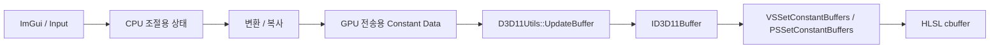
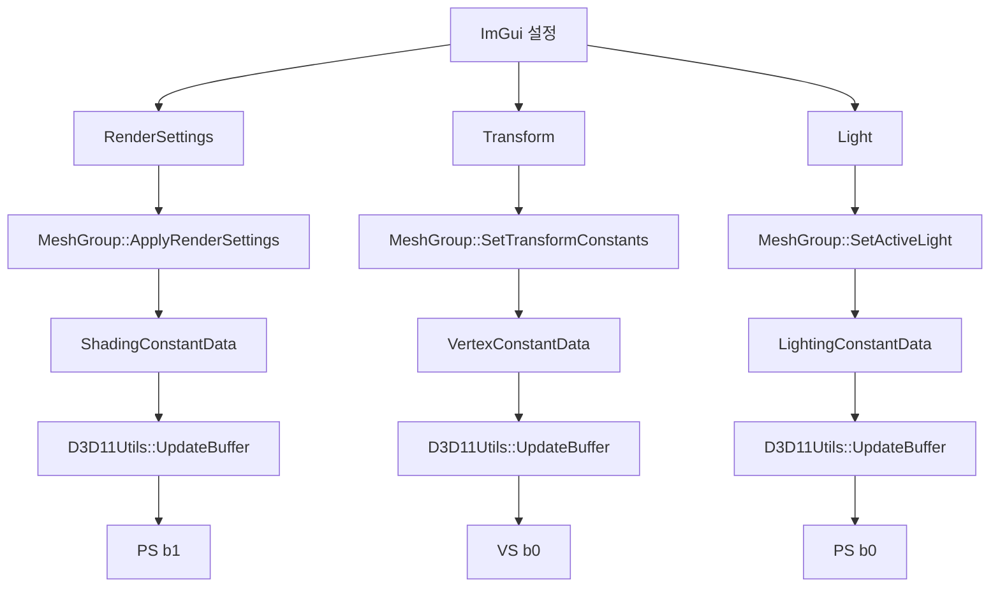
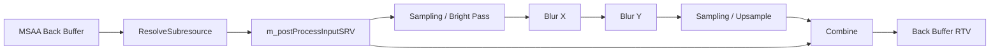
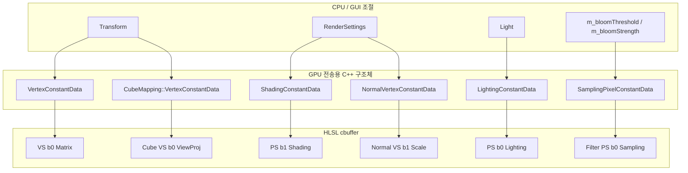

# Constant Buffer Flow

이 문서는 Ryudar 프로젝트에서 사용하는 Constant Buffer의 흐름을 정리한 문서입니다.

핵심은 다음 두 종류를 구분하는 것입니다.

- **CPU 조절용 구조체**: GUI나 애플리케이션 로직에서 사람이 다루기 좋게 만든 상태 구조체입니다. HLSL 레이아웃과 직접 맞을 필요는 없습니다.
- **GPU 전송용 구조체**: `ID3D11Buffer`에 그대로 복사되어 HLSL `cbuffer`와 메모리 레이아웃이 맞아야 하는 구조체입니다.

## 전체 흐름



Ryudar에서는 GUI가 바로 HLSL용 구조체를 모두 수정하지 않습니다. 일부 값은 GUI 친화적인 구조체에 저장되고, 렌더링 직전에 GPU 전송용 구조체로 변환됩니다.

대표적인 예가 `RenderSettings`입니다.

```text
ImGui
  -> RenderSettings
  -> MeshGroup::ApplyRenderSettings()
  -> ShadingConstantData
  -> ID3D11Buffer
  -> ClassicLitPixelShader.hlsl
```

## 구조체 분류

| 분류 | 구조체 / 상태 | 위치 | 역할 |
| --- | --- | --- | --- |
| CPU 조절용 | `RenderSettings` | `Headers/Rendering/ClassicLit/ClassicLitRenderSettings.h` | GUI가 수정하는 ClassicLit 렌더링 설정 묶음 |
| CPU 조절용 | `ShadingSettings` | `ClassicLitRenderSettings.h` | 텍스처 사용 여부, Phong / Blinn-Phong 선택 |
| CPU 조절용 | `EnvironmentSettings` | `ClassicLitRenderSettings.h` | IBL, Environment Reflection 사용 여부 |
| CPU 조절용 | `RimLightSettings` | `ClassicLitRenderSettings.h` | Rim Light 색상, 세기, power, smoothstep 여부 |
| CPU 조절용 + GPU 데이터 일부 | `Material` | `Headers/Scene/Material.h` | GUI에서 직접 수정되며, `ShadingConstantData` 안에 그대로 포함되어 GPU로 전송됨 |
| CPU 조절용 + GPU 데이터 일부 | `Light` | `Headers/Scene/Light.h` | GUI에서 선택/수정되고, `LightingConstantData`의 배열에 복사되어 GPU로 전송됨 |
| CPU 조절용 | `Transform` | `Headers/Scene/Transform.h` | GUI에서 위치/회전/스케일을 수정하고, `VertexConstantData`의 matrix로 변환됨 |
| GPU 전송용 | `VertexConstantData` | `Headers/Rendering/ClassicLit/ClassicLitConstantData.h` | 일반 mesh vertex shader용 matrix 묶음 |
| GPU 전송용 | `LightingConstantData` | `ClassicLitConstantData.h` | light 배열과 camera 위치 |
| GPU 전송용 | `ShadingConstantData` | `ClassicLitConstantData.h` | material, rim light, shading option, environment option |
| GPU 전송용 | `RimLightConstantData` | `ClassicLitConstantData.h` | HLSL cbuffer에 맞춘 Rim Light 데이터 |
| GPU 전송용 | `ShadingOptionsConstantData` | `ClassicLitConstantData.h` | HLSL cbuffer에 맞춘 texture/shading model 옵션 |
| GPU 전송용 | `EnvironmentConstantData` | `ClassicLitConstantData.h` | HLSL cbuffer에 맞춘 IBL/environment 옵션 |
| GPU 전송용 | `NormalVertexConstantData` | `ClassicLitConstantData.h` | normal debug line 길이 |
| GPU 전송용 | `CubeMapping::VertexConstantData` | `Headers/Rendering/CubeMapping.h` | skybox용 `viewProj` matrix |
| GPU 전송용 | `SamplingPixelConstantData` | `Headers/Rendering/ImageFilter.h` | post process용 texel size, threshold, strength |
| GPU 리소스 보관 | `Mesh` | `Headers/Geometry/Mesh.h` | constant buffer 객체 포인터를 보관하지만, 자체가 cbuffer 데이터는 아님 |

## ClassicLit Mesh Constant Buffer

ClassicLit 경로는 일반 3D mesh를 그릴 때 사용하는 메인 렌더링 경로입니다.

관련 파일:

- `Headers/Rendering/ClassicLit/ClassicLitConstantData.h`
- `Headers/Rendering/ClassicLit/ClassicLitRenderSettings.h`
- `Sources/Rendering/ClassicLit/ClassicLitMeshGroup.cpp`
- `Shaders/ClassicLitVertexShader.hlsl`
- `Shaders/ClassicLitPixelShader.hlsl`

### ClassicLit 전체 흐름



### Constant Buffer 목록

| C++ 구조체 | HLSL cbuffer | Shader Stage | Slot | 생성 위치 | 갱신 위치 | 바인딩 위치 |
| --- | --- | --- | --- | --- | --- | --- |
| `VertexConstantData` | `ModelViewProjectionConstantBuffer` | Vertex Shader | `b0` | `MeshGroup::Initialize()` | `MeshGroup::UpdateConstantBuffers()` | `MeshGroup::Render()` |
| `LightingConstantData` | `LightingConstantBuffer` | Pixel Shader | `b0` | `MeshGroup::Initialize()` | `MeshGroup::UpdateConstantBuffers()` | `MeshGroup::Render()` |
| `ShadingConstantData` | `ShadingConstantBuffer` | Pixel Shader | `b1` | `MeshGroup::Initialize()` | `MeshGroup::UpdateConstantBuffers()` | `MeshGroup::Render()` |

### VertexConstantData

```cpp
struct VertexConstantData
{
    Matrix modelWorld;
    Matrix invTranspose;
    Matrix view;
    Matrix projection;
};
```

HLSL:

```hlsl
cbuffer ModelViewProjectionConstantBuffer : register(b0)
{
    matrix model;
    matrix invTranspose;
    matrix view;
    matrix projection;
};
```

역할:

- model 좌표를 world 좌표로 변환합니다.
- normal 변환을 위해 inverse transpose matrix를 전달합니다.
- view / projection matrix를 vertex shader에 전달합니다.

데이터 출처:

```text
Transform
Camera
  -> Ryudar::Update()
  -> MeshGroup::SetTransformConstants()
  -> VertexConstantData
```

중요한 점:

- `Transform`은 CPU 조절용입니다.
- `VertexConstantData`는 GPU 전송용입니다.
- `Ryudar::Update()`에서 matrix를 transpose해서 전달합니다.

```cpp
visibleMeshGroup.SetTransformConstants(
    modelRow.Transpose(),
    invTransposeRow.Transpose(),
    viewRow.Transpose(),
    projRow.Transpose());
```

### LightingConstantData

```cpp
struct LightingConstantData
{
    Light lights[MaxLights];
    Vector3 eyeWorld;
    float padding;
};
```

HLSL:

```hlsl
cbuffer LightingConstantBuffer : register(b0)
{
    Light lights[MAX_LIGHTS];

    float3 eyeWorld;
    float padding;
};
```

역할:

- Directional / Point / Spot Light 데이터를 pixel shader에 전달합니다.
- camera world position인 `eyeWorld`를 전달합니다.

데이터 출처:

```text
Ryudar::m_selectedLightType
Ryudar::m_editableLight
Camera::GetEyePos()
  -> MeshGroup::SetActiveLight()
  -> MeshGroup::SetEyePosition()
  -> LightingConstantData
```

현재 구조에서 주의할 점:

- `SetActiveLight(std::size_t index, const Light &light)`는 구현상 배열 index를 받습니다.
- 실제 의미는 `LightType` 선택이므로, 장기적으로는 `LightType`을 받도록 바꾸는 편이 더 명확합니다.
- `MaxLights`는 `Light.h`에 정의되어 있고, `LightType::Count` 기반입니다.

### ShadingConstantData

```cpp
struct ShadingConstantData
{
    Material material;                         // 64
    RimLightConstantData rimLight;             // 32
    ShadingOptionsConstantData shadingOptions; // 16
    EnvironmentConstantData environment;       // 16
};
```

HLSL:

```hlsl
cbuffer ShadingConstantBuffer : register(b1)
{
    Material material;

    float3 rimColor;
    float rimPower;

    float rimStrength;
    uint useRimLight;
    uint useSmoothstep;
    float rimPadding;

    uint useTexture;
    uint shadingModel;
    float2 shadingPadding;

    uint useIBL;
    uint useEnvironmentReflection;
    float2 environmentPadding;
};
```

역할:

- material 값
- rim light 값
- texture 사용 여부
- Phong / Blinn-Phong 선택
- IBL 사용 여부
- Environment Reflection 사용 여부

데이터 출처:

```text
ImGui
  -> RenderSettings
  -> MeshGroup::ApplyRenderSettings()
  -> ShadingConstantData
```

`RenderSettings`는 CPU 조절용이고, `ShadingConstantData`는 GPU 전송용입니다.

```cpp
struct RenderSettings
{
    Material material;
    ShadingSettings shading;
    EnvironmentSettings environment;
    RimLightSettings rimLight;
};
```

`ApplyRenderSettings()`가 CPU 조절용 구조체를 GPU 전송용 구조체로 복사/변환합니다.

```text
RenderSettings::material
  -> ShadingConstantData::material

RenderSettings::shading
  -> ShadingConstantData::shadingOptions

RenderSettings::environment
  -> ShadingConstantData::environment

RenderSettings::rimLight
  -> ShadingConstantData::rimLight
```

주의할 점:

- `ShadingConstantData`의 순서는 HLSL `ShadingConstantBuffer`와 반드시 맞아야 합니다.
- 단순히 `RenderSettings`와 순서를 맞추려고 `ShadingConstantData` 순서를 바꾸면 안 됩니다.
- 순서를 바꾸려면 HLSL cbuffer 순서도 함께 바꿔야 합니다.
- 읽기 편하게 맞추고 싶다면, GPU 구조체보다 CPU 조절용 `RenderSettings` 순서를 바꾸는 쪽이 안전합니다.

## Normal Debug Constant Buffer

Normal Debug 렌더링은 일반 mesh 위에 normal 방향 line을 추가로 그리는 경로입니다.

관련 파일:

- `Headers/Rendering/ClassicLit/ClassicLitConstantData.h`
- `Sources/Rendering/ClassicLit/ClassicLitMeshGroup.cpp`
- `Shaders/NormalVertexShader.hlsl`
- `Shaders/NormalPixelShader.hlsl`

### Constant Buffer 목록

| C++ 구조체 | HLSL cbuffer | Shader Stage | Slot | 역할 |
| --- | --- | --- | --- | --- |
| `VertexConstantData` | 첫 번째 `NormalVertexConstantBuffer` | Vertex Shader | `b0` | model, invTranspose, view, projection |
| `NormalVertexConstantData` | 두 번째 `NormalVertexConstantBuffer` | Vertex Shader | `b1` | normal line 길이 |

현재 HLSL에는 같은 이름의 cbuffer가 두 번 선언되어 있습니다.

```hlsl
cbuffer NormalVertexConstantBuffer : register(b0)
{
    matrix model;
    matrix invTranspose;
    matrix view;
    matrix projection;
}

cbuffer NormalVertexConstantBuffer : register(b1)
{
    float scale;
};
```

동작은 하지만, 이름이 중복되어 읽을 때 혼란스럽습니다.

개선한다면 다음처럼 이름을 분리하는 것이 좋습니다.

```hlsl
cbuffer NormalTransformConstantBuffer : register(b0)
{
    matrix model;
    matrix invTranspose;
    matrix view;
    matrix projection;
}

cbuffer NormalScaleConstantBuffer : register(b1)
{
    float scale;
};
```

### NormalVertexConstantData

```cpp
struct NormalVertexConstantData
{
    float scale = 0.1f;
    float padding[3] = {};
};
```

역할:

- normal debug line의 길이를 조절합니다.

데이터 출처:

```text
ImGui "Normal scale"
  -> MeshGroup::SetNormalScale()
  -> NormalVertexConstantData::scale
```

갱신 특징:

- `scale`이 바뀌면 `m_drawNormalsDirtyFlag`가 켜집니다.
- normal 표시가 켜져 있고 dirty일 때만 GPU buffer를 갱신합니다.

```cpp
if (m_drawNormals && m_drawNormalsDirtyFlag)
{
    D3D11Utils::UpdateBuffer(context, m_normalVertexConstantData,
                             m_normalVertexConstantBuffer.Get());
    m_drawNormalsDirtyFlag = false;
}
```

## CubeMapping Constant Buffer

CubeMapping은 skybox를 그리는 렌더링 경로입니다.

관련 파일:

- `Headers/Rendering/CubeMapping.h`
- `Sources/Rendering/CubeMapping.cpp`
- `Shaders/CubeMappingVertexShader.hlsl`
- `Shaders/CubeMappingPixelShader.hlsl`

### CubeMapping::VertexConstantData

```cpp
struct VertexConstantData
{
    Matrix viewProj;
};
```

HLSL:

```hlsl
cbuffer VertexConstantBuffer : register(b0)
{
    matrix viewProj;
};
```

역할:

- skybox vertex를 view/projection 공간으로 보냅니다.
- skybox는 camera 위치 이동을 직접 반영하지 않고, 회전과 투영 중심으로 처리합니다.

데이터 출처:

```text
Camera view/projection
  -> Ryudar::Update()
  -> CubeMapping::UpdateConstantBuffers()
  -> CubeMapping::VertexConstantData
```

갱신 코드:

```cpp
vertexConstantData.viewProj = projCol * viewCol;
D3D11Utils::UpdateBuffer(context, vertexConstantData,
                         m_cubeMesh.vertexConstantBuffer.Get());
```

바인딩:

```cpp
context->VSSetConstantBuffers(0, 1, m_cubeMesh.vertexConstantBuffer.GetAddressOf());
```

## ImageFilter / Post Process Constant Buffer

ImageFilter는 후처리 한 pass를 표현합니다.

관련 파일:

- `Headers/Rendering/ImageFilter.h`
- `Sources/Rendering/ImageFilter.cpp`
- `Shaders/SamplingPixelShader.hlsl`
- `Shaders/BlurXPixelShader.hlsl`
- `Shaders/BlurYPixelShader.hlsl`
- `Shaders/CombinePixelShader.hlsl`

### SamplingPixelConstantData

```cpp
struct SamplingPixelConstantData
{
    float texelWidth = 0.f;
    float texelHeight = 0.f;
    float threshold = 0.f;
    float strength = 0.f;
};
```

HLSL:

```hlsl
cbuffer SamplingPixelConstantData : register(b0)
{
    float texelWidth;
    float texelHeight;
    float threshold;
    float strength;
};
```

역할:

| 필드 | 사용처 | 의미 |
| --- | --- | --- |
| `texelWidth` | Blur X | 현재 출력 texture 기준 한 texel의 가로 크기 |
| `texelHeight` | Blur Y | 현재 출력 texture 기준 한 texel의 세로 크기 |
| `threshold` | Sampling Pixel Shader | bloom bright pass 임계값 |
| `strength` | Combine Pixel Shader | 원본 또는 bloom 합성 강도 |

데이터 출처:

```text
ImageFilter 생성 시 width / height
  -> texelWidth / texelHeight

ImGui Bloom Threshold
  -> Ryudar::m_bloomThreshold
  -> first ImageFilter threshold

ImGui Bloom Strength
  -> Ryudar::m_bloomStrength
  -> last Combine ImageFilter strength
```

### Bloom에서의 흐름



`BuildFilters()`에서 각 filter는 자기 해상도에 맞는 `texelWidth`, `texelHeight`를 갖습니다.

```cpp
m_pixelConstData.texelWidth = 1.0f / width;
m_pixelConstData.texelHeight = 1.0f / height;
```

GUI에서 변경되는 값은 매 프레임 항상 모든 filter에 올라가는 것이 아니라, dirty flag가 켜졌을 때 필요한 filter에만 반영됩니다.

```cpp
if (m_postProcessConstantsDirty)
{
    m_filters[0]->SetThreshold(m_bloomThreshold);
    m_filters[0]->UpdateConstantBuffers(m_context.Get());

    m_filters.back()->SetStrength(m_bloomStrength);
    m_filters.back()->UpdateConstantBuffers(m_context.Get());

    m_postProcessConstantsDirty = false;
}
```

## D3D11Utils 관점

Constant Buffer 생성과 갱신은 `D3D11Utils`가 공통으로 처리합니다.

### 생성

```cpp
D3D11Utils::CreateConstantBuffer(device, data, buffer);
```

내부적으로:

- `D3D11_USAGE_DYNAMIC`
- `D3D11_BIND_CONSTANT_BUFFER`
- `D3D11_CPU_ACCESS_WRITE`

를 사용합니다.

즉, CPU가 매 프레임 값을 갱신할 수 있는 GPU buffer입니다.

### 갱신

```cpp
D3D11Utils::UpdateBuffer(context, data, buffer);
```

내부적으로:

```text
Map(D3D11_MAP_WRITE_DISCARD)
  -> memcpy
  -> Unmap
```

흐름입니다.

## CPU 조절용 vs GPU 전송용

### CPU 조절용 구조체

CPU 조절용 구조체는 GUI와 게임 로직이 직접 다루는 구조체입니다.

| 구조체 / 상태 | 누가 수정하는가 | GPU layout 의존 여부 |
| --- | --- | --- |
| `RenderSettings` | ImGui | 낮음 |
| `ShadingSettings` | ImGui | 낮음 |
| `EnvironmentSettings` | ImGui | 낮음 |
| `RimLightSettings` | ImGui | 낮음 |
| `Transform` | ImGui | 낮음 |
| `m_selectedLightType` | ImGui | 낮음 |
| `m_editableLight` | ImGui | 중간. 최종적으로 `Light` layout은 HLSL과 맞아야 함 |
| `m_bloomThreshold` | ImGui | 낮음 |
| `m_bloomStrength` | ImGui | 낮음 |

### GPU 전송용 구조체

GPU 전송용 구조체는 HLSL `cbuffer`와 순서, 크기, padding이 맞아야 합니다.

| 구조체 | HLSL과 순서 일치 필요 | 16-byte 정렬 필요 | 임의 순서 변경 가능 여부 |
| --- | --- | --- | --- |
| `Material` | 필요 | 필요 | HLSL `Material`도 같이 바꿔야 가능 |
| `Light` | 필요 | 필요 | HLSL `Light`도 같이 바꿔야 가능 |
| `VertexConstantData` | 필요 | 필요 | HLSL cbuffer도 같이 바꿔야 가능 |
| `LightingConstantData` | 필요 | 필요 | HLSL cbuffer도 같이 바꿔야 가능 |
| `ShadingConstantData` | 필요 | 필요 | HLSL cbuffer도 같이 바꿔야 가능 |
| `NormalVertexConstantData` | 필요 | 필요 | HLSL cbuffer도 같이 바꿔야 가능 |
| `CubeMapping::VertexConstantData` | 필요 | 필요 | HLSL cbuffer도 같이 바꿔야 가능 |
| `SamplingPixelConstantData` | 필요 | 필요 | HLSL cbuffer도 같이 바꿔야 가능 |

## 가장 헷갈리기 쉬운 지점

### 1. RenderSettings와 ShadingConstantData는 목적이 다르다

`RenderSettings`는 GUI 친화적 구조체입니다.

```cpp
struct RenderSettings
{
    Material material;
    ShadingSettings shading;
    EnvironmentSettings environment;
    RimLightSettings rimLight;
};
```

`ShadingConstantData`는 GPU layout 구조체입니다.

```cpp
struct ShadingConstantData
{
    Material material;
    RimLightConstantData rimLight;
    ShadingOptionsConstantData shadingOptions;
    EnvironmentConstantData environment;
};
```

둘의 순서가 다르더라도 문제는 없습니다. `ApplyRenderSettings()`가 명시적으로 값을 복사하기 때문입니다.

문제가 되는 경우는 `ShadingConstantData` 순서만 바꾸고 HLSL cbuffer 순서를 바꾸지 않는 경우입니다.

### 2. Material은 CPU 설정이면서 GPU layout 데이터다

`Material`은 GUI에서 직접 수정됩니다.

```cpp
auto &material = settings.material;
ImGui::SliderFloat("Material Diffuse", &diffuse, 0.0f, 3.0f);
```

하지만 동시에 `ShadingConstantData` 안에 그대로 들어가 GPU로 전송됩니다.

```cpp
m_shadingConstantData.material = m_renderSettings.material;
```

따라서 `Material`은 CPU 조절용이면서 GPU layout 제약도 받습니다.

### 3. Light도 CPU 설정이면서 GPU layout 데이터다

`m_editableLight`는 GUI에서 수정됩니다.

하지만 최종적으로 `LightingConstantData::lights[]`에 복사됩니다.

```cpp
m_lightingConstantData.lights[index] = light;
```

따라서 `Light`도 HLSL `struct Light`와 순서를 맞춰야 합니다.

### 4. Mesh는 Constant Buffer 데이터가 아니다

`Mesh` 안에는 다음 멤버가 있습니다.

```cpp
ComPtr<ID3D11Buffer> vertexConstantBuffer;
ComPtr<ID3D11Buffer> pixelConstantBuffer;
```

하지만 `Mesh` 자체가 constant buffer 데이터 구조체는 아닙니다.

`Mesh`는 GPU buffer 객체를 들고 있는 리소스 컨테이너입니다.

## 현재 구조 요약



## 리팩토링 시 추천 방향

### 1. GPU 전송용 구조체 이름에 `Gpu` 또는 `ConstantData`를 유지한다

현재도 대부분 `ConstantData` 이름을 쓰고 있어 방향은 좋습니다.

예:

```text
RenderSettings        // CPU 조절용
ShadingConstantData   // GPU 전송용
```

이 구분을 계속 유지하는 것이 좋습니다.

### 2. RenderSettings 순서는 가독성 기준으로 바꿔도 된다

`RenderSettings`는 CPU 조절용이므로 순서를 바꿔도 HLSL에 영향이 없습니다.

반대로 `ShadingConstantData`는 HLSL과 묶여 있으므로 신중해야 합니다.

### 3. HLSL cbuffer 이름을 C++ 구조체 이름과 더 맞춘다

예를 들어 Normal shader의 두 cbuffer는 이름이 같습니다.

```hlsl
cbuffer NormalVertexConstantBuffer : register(b0)
cbuffer NormalVertexConstantBuffer : register(b1)
```

이건 다음처럼 바꾸면 읽기 좋아집니다.

```hlsl
cbuffer NormalTransformConstantBuffer : register(b0)
cbuffer NormalScaleConstantBuffer : register(b1)
```

### 4. offset 검증을 추가한다

`sizeof`만 확인하면 전체 크기만 검증됩니다. 필드 순서 실수를 더 잘 잡으려면 `offsetof` 검증도 추가할 수 있습니다.

예:

```cpp
static_assert(offsetof(ShadingConstantData, material) == 0);
static_assert(offsetof(ShadingConstantData, rimLight) == 64);
static_assert(offsetof(ShadingConstantData, shadingOptions) == 96);
static_assert(offsetof(ShadingConstantData, environment) == 112);
```

이렇게 하면 C++ 구조체 필드 순서가 의도와 다르게 바뀌었을 때 더 빨리 알 수 있습니다.

