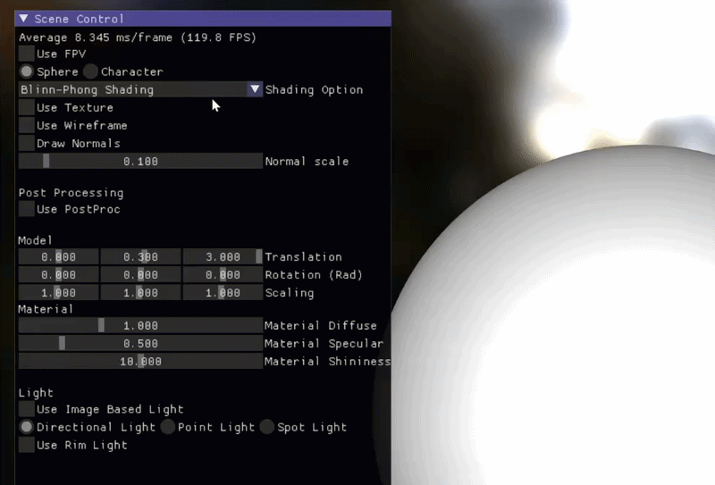
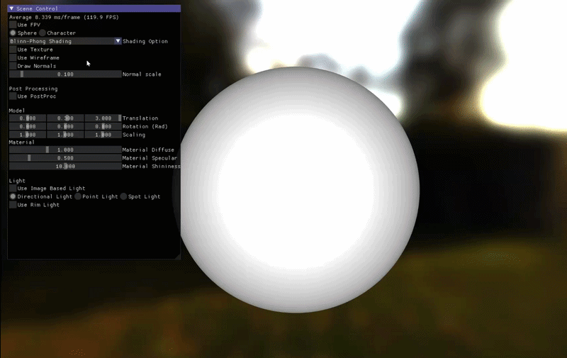
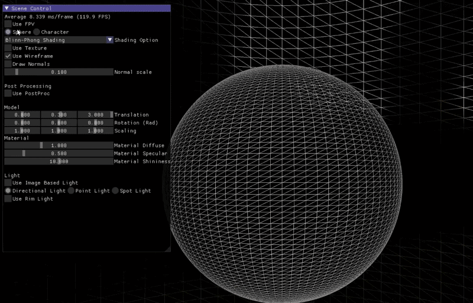
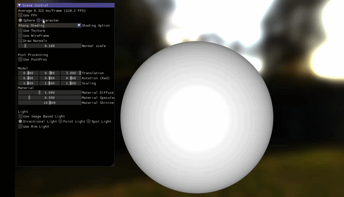
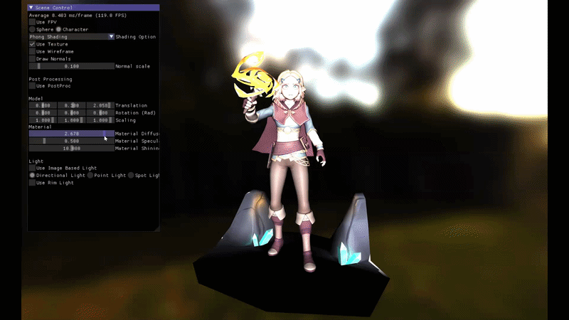
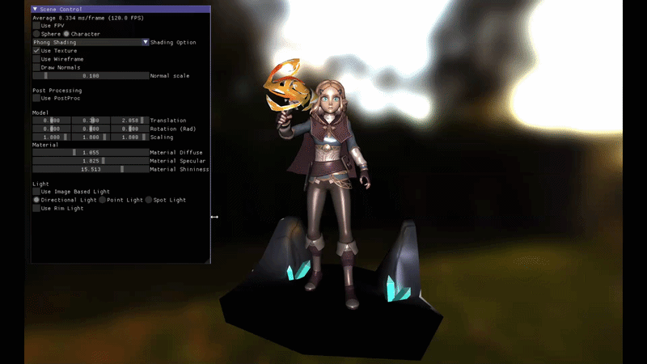
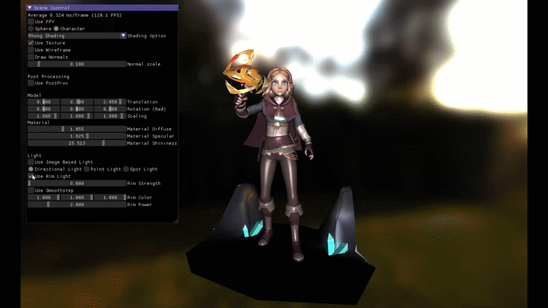
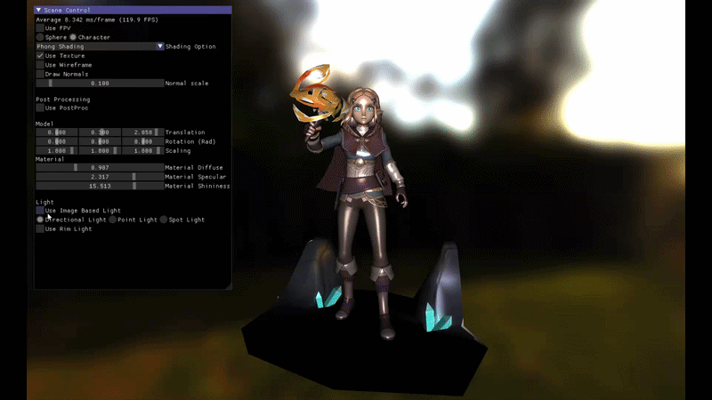

# Ryudar

DirectX 11 と C++17 で実装したリアルタイム 3D レンダラーです。  
Direct3D 11 初期化、GPU リソース管理、HLSL シェーダー、ライティング、ポストプロセスまでを実装しています。

ImGui の `Scene Control` パネルから、描画方式、ライト、マテリアル、モデル Transform、Bloom などをリアルタイムに変更できます。

## 1. 提出物の構成

この提出フォルダーには、すぐに確認できる実行版(01_Executable)と、実装内容を確認するためのソースコード一式(02_SourceCode)を収録しています。また、プロジェクトの構造についてはDocsフォルダーから確認できます。

| パス | 内容 |
| --- | --- |
| [`Run_Ryudar.bat`](./Run_Ryudar.bat) | 提出フォルダー直下の実行用バッチファイルです。 |
| [`01_Executable`](./01_Executable) | Release x64 でビルドした実行版です。`Ryudar.exe`、必要な DLL、HLSL、Asset を収録しています。 |
| [`02_SourceCode`](./02_SourceCode) | Visual Studio ソリューション、C++ / HLSL ソース、実行用 Asset を収録しています。 |
| [`Docs`](./Docs) | プロジェクト全体の構造説明を収録しています。 |
| [`ThirdPartyLicenses`](./ThirdPartyLicenses) | 使用したオープンソースライブラリのライセンス情報を収録しています。 |

## 2. プロジェクト概要

Ryudar は、C++ と DirectX 11 を使用して実装したリアルタイム 3D レンダラーです。

主な特徴は以下です。

- HLSL によるライティングとポストプロセス
- ImGui によるリアルタイムパラメーター編集
- FBX モデルと Procedural Mesh の描画
- Cubemap、IBL、Bloom を含むレンダリング

## 3. 主な機能

### Shading Model

Phong と Blinn-Phong を切り替え、specular highlight の計算モデルを比較できます。

### Texture Toggle

Texture sampling の有効 / 無効を切り替え、material color と texture 適用結果を確認できます。

### Debug View

Normal 可視化と wireframe 表示で、mesh の向きや形状を確認できます。

### Object Transform / Selection

選択中の object に対して Translation、Rotation、Scale を個別に適用できます。

### Material Parameters

Diffuse、Specular、Shininess を調整し、材質の反射特性を変更できます。

### Light Type

Directional、Point、Spot Light を切り替え、light type ごとの照明結果を確認できます。

### Rim Light

Rim Light により、object の輪郭付近を強調できます。

### Image Based Lighting

IBL により、environment map を使った diffuse / specular lighting を適用できます。

### Post Processing

Bloom の threshold、strength、blur を調整し、画面全体の発光表現を制御できます。

### First-Person Camera

WASD と mouse 操作で、scene 内を First-Person Camera として移動できます。

## 4. 操作方法

右側の `Scene Control` ウィンドウから各レンダリング設定を変更できます。

### 基本操作

| 操作 | 内容 |
| --- | --- |
| `Use FPV` | First-Person Camera の ON / OFF |
| `W` / `S` | 前進 / 後退。`Use FPV` が ON の場合のみ有効です。 |
| `A` / `D` | 左移動 / 右移動。`Use FPV` が ON の場合のみ有効です。 |
| マウス移動 | カメラ方向の変更。`Use FPV` が ON の場合のみ有効です。 |
| `ESC` | アプリケーション終了 |

### 主な GUI 項目

| 項目 | 内容 |
| --- | --- |
| `Sphere / Character` | 表示モデルの選択 |
| `Shading Option` | Phong / Blinn-Phong の選択 |
| `Use Texture` / `Use Wireframe` / `Draw Normals` | 描画デバッグ設定 |
| `Use PostProc` | Bloom の有効化、Threshold と Strength の調整 |
| `Model` | Translation、Rotation、Scaling の調整 |
| `Material` | Fresnel R0、Diffuse、Specular、Shininess の調整 |
| `Light` | Direct Light、IBL、Environment Reflection、Rim Light の設定 |

## 5. 実装上のポイント

- CPU と HLSL の Constant Buffer 配置を合わせ、`static_assert` でサイズと 16-byte 境界を検証しています。
- Non-uniform Scale でも法線を正しく変換するため、Model 行列の逆転置行列を使用しています。
- DirectX の Row Vector と HLSL 側の行列配置を意識し、GPU 転送時に Transpose しています。
- GUI 用の `RenderSettings` と GPU 転送用 Constant Data を分離しています。
- Sphere と Character が個別の Transform、Material、描画設定を所有します。
- Bloom は固定処理ではなく、`ImageFilter` を連結する Pass 構成として実装しています。
- リサイズ前に RTV / SRV の Binding を解除し、Swap Chain 関連リソースを再生成します。

## 8. 使用技術・ライブラリ

| 分類 | 内容 |
| --- | --- |
| Language | C++17 |
| Platform | Win32 API |
| Graphics | DirectX 11 / DXGI / HLSL Shader Model 5.0 |
| Math / Texture | DirectXTK / DirectXMath |
| GUI | Dear ImGui |
| Model Loading | Assimp |
| Image Loading | stb_image |
| Package | vcpkg |

外部ライブラリのライセンスは [`ThirdPartyLicenses`](./ThirdPartyLicenses) フォルダーに収録しています。

## 9. 実行方法

### 手順

1. 提出フォルダー直下の [`Run_Ryudar.bat`](./Run_Ryudar.bat) を実行します。
2. または、[`01_Executable/Ryudar.exe`](./01_Executable/Ryudar.exe) を直接実行します。

### 動作環境

- Windows 10 / 11 64-bit
- DirectX 11 Feature Level 11.0 対応 GPU

Visual Studio、vcpkg、追加ライブラリのインストールは不要です。  
実行に必要な Visual C++ Runtime と DLL は同梱しています。

Asset と Shader は相対パスで読み込むため、`01_Executable` 内の構成を維持してください。

## 10. ソースコードの確認・ビルド

プロジェクト全体の構造は [`Docs/ArchitectureOverview.md`](./Docs/ArchitectureOverview.md) にまとめています。  
コードを確認する前に読むことで、主要クラスの関係とレンダリングフローを把握できます。

詳細なビルド条件と依存パッケージは、[`02_SourceCode/BUILD.md`](./02_SourceCode/BUILD.md) および [`02_SourceCode/vcpkg.json`](./02_SourceCode/vcpkg.json) に記載しています。
